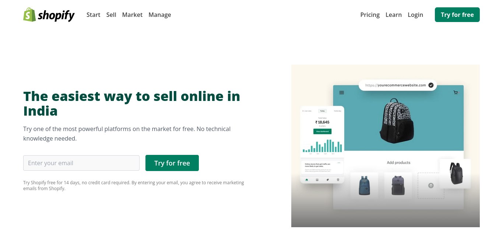

# A fully responsive shopify website clone

> By Aditya Kadali

## Screenshots:

- Desktop View
  
- Mobile view
  

## Built with:

- Tailwind CSS
- Semantic HTML5

## Key learnings:

- In this project I learned so much about responsive design.
- I learned ro extend default tailwind colors and use tailwild components.

## Time taken:

- This project took me around 10+ hours

## Links:

- [Live Demo](https://shopify-clne.netlify.app/)
- [Source](https://github.com/Adityakadali/shopify-clone)
